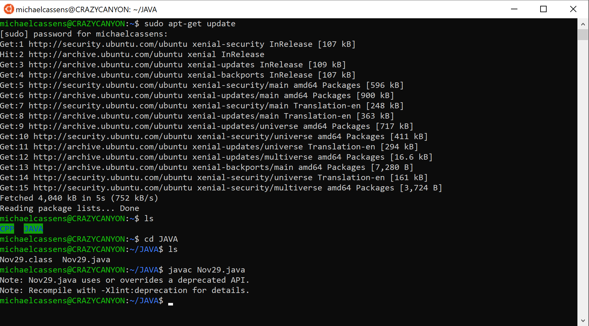
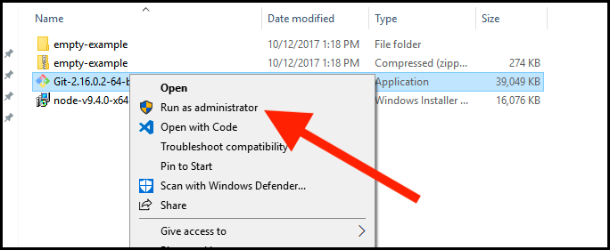
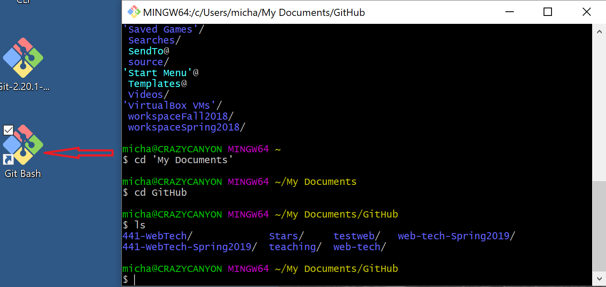

# Your Computer Environment

  <button class="tablinks active" onclick="openTab(event, 'Overview')">Overview</button>
  <button class="tablinks" onclick="openTab(event, 'GUI')">Graphical User Interface</button>
  <button class="tablinks" onclick="openTab(event, 'ToDoGUI')">To Do</button>
  <button class="tablinks" onclick="openTab(event, 'CLI')">Command Line Interface</button>
  <button class="tablinks" onclick="openTab(event, 'Learning')">Learning CLI</button>
  <button class="tablinks" onclick="openTab(event, 'ToDoCLI')">To Do</button>
  

<a href="//www.youtube.com/embed/Jian1ilJwBs" data-lity>Computer Environment Video</a>

As a creative technologist and developer, you will need to take control of your computer. You should start to consider your computer as an instrument or an innovative tool that serves as an extension of yourself.

To be effective, you need to be comfortable with your computer and <b>know</b> your computer.

There are two different ways to find things on your computer.

<ol>
<li>Through the graphical user interface</li>
<li>Through the command-line interface</li>
</ol>

We will go through the graphical user interface, and I will discuss the command line interface.  If you are interested in further exploring the command-line, I will give you more information, but it will not be the focus.

We need to define what a directory is and what a file is.

What is a directory?

   <ol>

   <li>A <b>directory</b> is a folder. It's just a fancy word for the folder.  Remember, we are mimicking the physical desk. That's why we have a <b>desktop</b>, <b>folders</b> and <b>files</b>. It's so we can relate to them.</li>
   <li><b>Files</b> are what we are storing.  Maybe they are pictures, videos, text documents, music, and more.</li>
    </ol>

<b>Why do we care?</b>
 

We care because we want to organize our folders/directories and the files within them so that we can find them again. Yes, we have a search bar that helps us, but it's much better to store our files in an organized way.

How do we access our folders?

<ol>
<li>In Windows, you can click on the <b>Start</b> or <b>Search</b> and then look for <b>This PC.</b></li>
<li>On Mac, click on <b>Finder</b> and then go through the folders.</li>
</ol>

Let's do some hands-on work here.

Go into your <b>Documents</b> folder regardless if you are on Windows or Mac and create a new Folder.  How do we do that?

<ol>
<li>Right-click and choose <b>New Folder</b>.</li>  
<li>Rename the folder <b>MART 120</b>.  </li>
<li>Inside that folder, create a new folder called <b>My Best Folder</b>.  </li>
<li>Inside of that folder, create a new file by opening <b>TextEdit</b> on a Mac or <b>Notepad</b> on Windows and place your name in it.  </li>
<li><b>Save</b> the file and close it.</li>
</ol>

I recommend creating a new folder for each homework, and then you can save all your projects in there.  We will do this inside your <b>GitHub</b> repository after we practice here in the Documents folder.  These skills will come in handy in your other classes too!

<i>Note: "Directories" and "Folders" are the same thing. These will be interchangeable throughout this course.</i>

<a href="//www.youtube.com/embed/R_wj7DrD_g0" data-lity>Command-line Interface Video</a>

One of the most basic ways of working with your computer is through a <a href="https://en.wikipedia.org/wiki/Command-line_interface" target="_new">command-line interface (CLI)</a>.

Although such programs can appear intimidating to a beginner user, these command-line programs remove are simple applications that allow for full control of the OS. These programs will enable a user to accomplish many of that same tasks that they are used to completing with a mouse through text-only commands. One reason to use such a program is to speed up the development process and display more information than is typical of a traditional "graphical user interface" (GUI; pronounced 'gooey') based environment.

One advantage of a CLI over a GUI-based file browser is quicker manipulation of files and directories. The manipulation of files and directories will be a widespread activity for you in this course. As such, please take a moment to read the following <a href="https://en.wikipedia.org/wiki/Directory_(computing)" target="_blank">Wikipedia page describing 'directories'</a> and make sure you understand what a directory is, as well as its related terminology.

<h4>Unix</h4>

Unix operating systems refer to both macOS (formerly OS X) and Linux. These OS's will use similar commands within their CLI's. On macOS, the default CLI is <b>terminal.app</b>. However, there are many CLI's that can be downloaded and used in Unix-based operating systems.

For those of you who are unfamiliar with using the terminal in Unix operating systems, you should work through the following book.

<a href="https://lab46.g7n.org/_media/haas/ufbm.pdf" target="_blank">Unix for the Beginning Mage</a>

This resource walks you through the basics of using terminal via a 'cutesy' story. (Sorry if this is not your thing. Unfortunately, it is an excellent resource.)

NOTE: If you do not have Xcode.app installed on your Mac, you should do so. We will not be using Xcode. However, it installs additional command-line tools that we will use. Install Xcode via the Mac App Store. After installing Xcode, open it once, close it, and forget about it for the time being.

<h4>Windows</h4>

Windows users have a couple of options when it comes to CLI. Traditionally, Windows has utilized a program known as Command Prompt for decades. This program is a relative of MS-DOS, an old operating system, and a precursor to Windows. In recent years there has been a move within the development community towards Window's newer PowerShell CLI. However, there is also a step towards a Bash-like or pure Bash (the Linux and macOS CLI) program for windows.

I am going to suggest you utilize the last of these options. Unfortunately, a Bash shell does not exist by default on Windows yet. You have two options to get one.

<ol>
<li>Windows now include a "Linux Environment" in the Windows Features.
   <ul>
    <li>To install the Window's approved "Windows Subsystem for Linux", please follow the instructions from the following site;</li>
    <li><a href="https://docs.microsoft.com/en-us/windows/wsl/install-win10" target="_blank">https://docs.microsoft.com/en-us/windows/wsl/install-win10</a></li>
    </ul>
</li>
<li>
A more straightforward solution (and the recommended one for this course), is to install a Bash-like CLI.

    
The disadvantage of this solution is the lack of integration as the "Windows Subsystem for Linux." However, for the CLI work you will do in this course, it works just fine.

</li>
</ol>

To get a Bash environment, windows users should install Git. Download Git below:

<a href="https://git-scm.com/download/win" target="_blank">https://git-scm.com/download/win</a>

After downloading the program, right-click the install executable and select "Run as Administrator." (<strong>THIS IS IMPORTANT</strong> You must run as administrator to give Git Bash necessary permissions.)

This file installs a program known as "Git," along with one called "Git Bash." You can now open "Git Bash".

After installing either "Windows Subsystem for Linux" or "Git Bash", you should work through the <a href="https://lab46.g7n.org/_media/haas/ufbm.pdf" target="_blank">Unix for the Beginning Mage</a> book.

Here is a CLI activity for you to practice.

Here is an online Linux terminal if you want to work directly in the browser:

&nbsp;

<iframe src="https://cocalc.com/projects?anonymous=true&session=default" width="100%" height="500"></iframe>

&nbsp;

<em>* Click on <strong>Welcome to CoCalc!</strong> and then click on the <strong>"+ New"</strong> icon and then <strong>Linux terminal</strong>

Be capable of performing the following actions via command line.

<ul>
  <li>Navigate between and around directories.</li>
  <li>List the contents of directories. (Including 'hidden' files')</li>
  <li>Be able to change a file's name.</li>
  <li>Be able to create an empty file.</li>
  <li>Be able to create a new directory.</li>
  <li>Be able to move a file/directory.</li>
  <li>Be able to delete a file.</li>
  <li>Be able to delete a directory.</li>
  <li>Understand what a 'superuser' is. (Unix only)</li>
  <li>Understand what file permissions are, how to view them, and how to change them. (Unix only)</li>
</ul>

