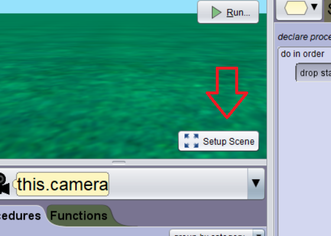
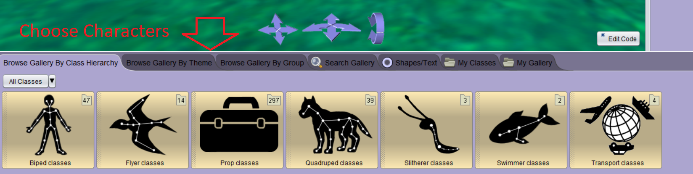

# Setup Scene

<a href="//www.youtube.com/embed/fIiOCPScZas" data-lity>Setup Scene Video</a>

After choosing `Setup Scene`, you can choose which characters and objects you want to add to your story.  Here you don't have to do any coding, but rather think about how you want your scene to look and how you want it to look.

