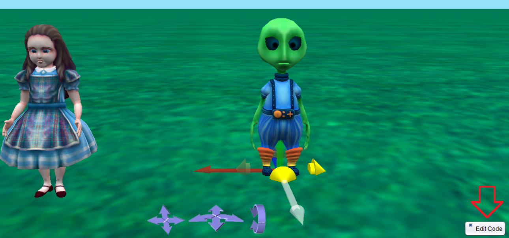
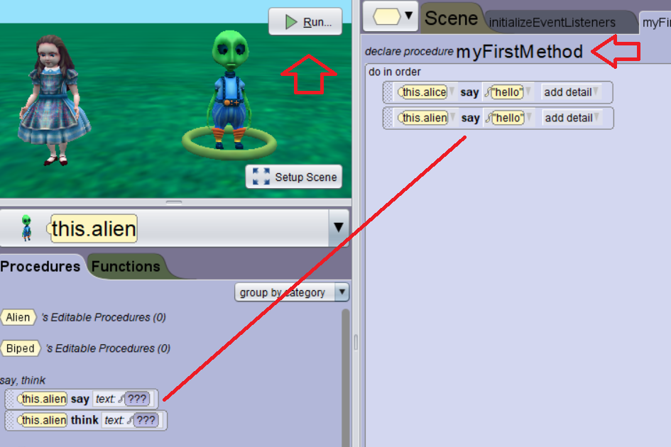
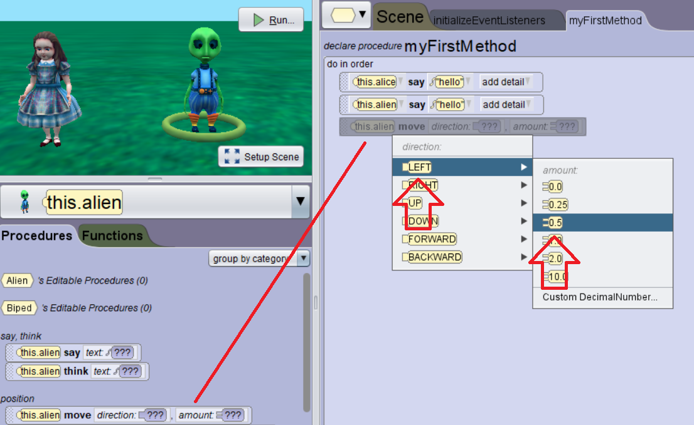

# Edit Code

  <button class="tablinks active" onclick="openTab(event, 'Overview')">Overview</button>
   <button class="tablinks" onclick="openTab(event, 'Move')">Movement</button>

<!-- Tab content -->

<a href="//www.youtube.com/embed/fyZiuVeMzN8" data-lity>Edit Code Video</a>

Once you have your scene created, you can change the code to make your objects move, interact, collide, and more!  Let's see how this works with two objects.

Notice you can select an object, and you create code for that particular object.  Remember in Scratch where each object had their code section and then in App Lab they shared?  Here, each object has its code, but they share <b>myFirstMethod</b>.  Let's take a look at how to make the objects do something.

Once we have added code, we press <b>Run</b>, and we can see what the code does.

Did they both say "hello"?  Good!

We can also make the objects move, and instead of having multiple move commands, we can add more attributes or options to make them move the way we want.  When you add a ,<b>move</b> command onto the screen, it will ask which way to proceed.  If you select <b>Left</b>, which way will the player move? Did you figure this out? Why?  Watch the video, and I will explain it.

<a href="//www.youtube.com/embed/dnUFXLrw1Mc" data-lity>Movement Video</a>

