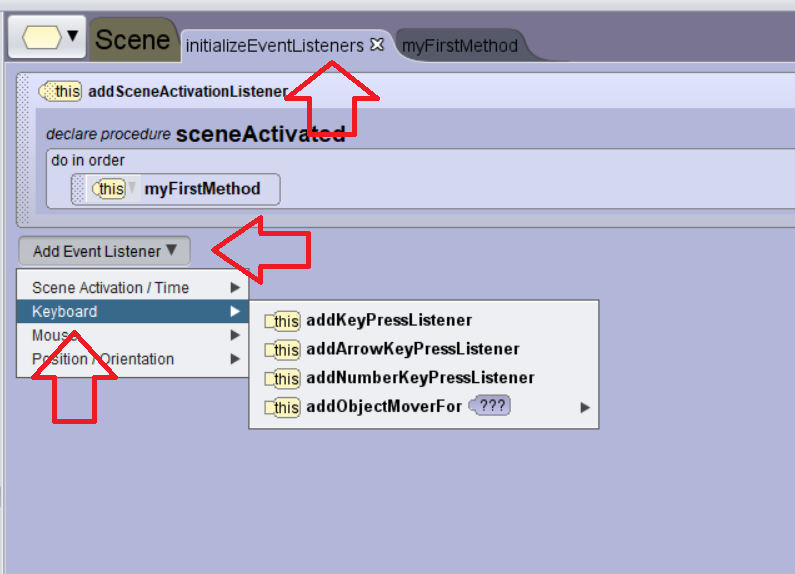

# Events

To make things more interesting, we want to add event handling.  As we know from other programs, we have event handlers for keys, mice, and event timers.  We are going to explore each of these in the next videos.

<!-- video for keys -->
## Key Events

<a href="//www.youtube.com/embed/hdMWJxfZAeM" data-lity>Key Events Video</a>

<!-- video for mouse -->
## Mouse Events

<a href="//www.youtube.com/embed/WcrVKZQVO-E" data-lity>Mouse Events Video</a>

<!-- video for timer -->

## Timer Events

<a href="//www.youtube.com/embed/Y5gl3YBHTuc" data-lity>Timer Events Video</a>

