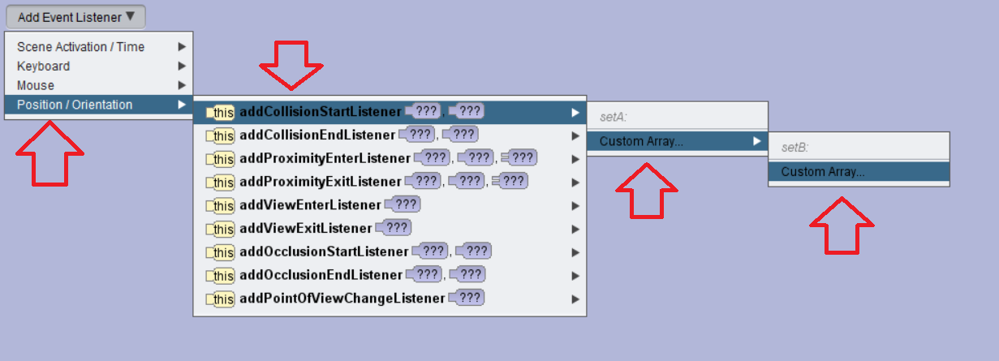
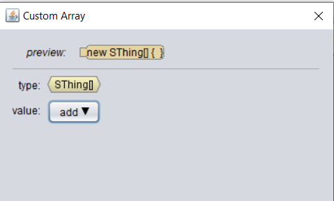
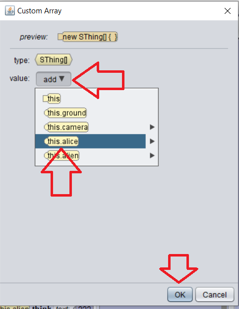
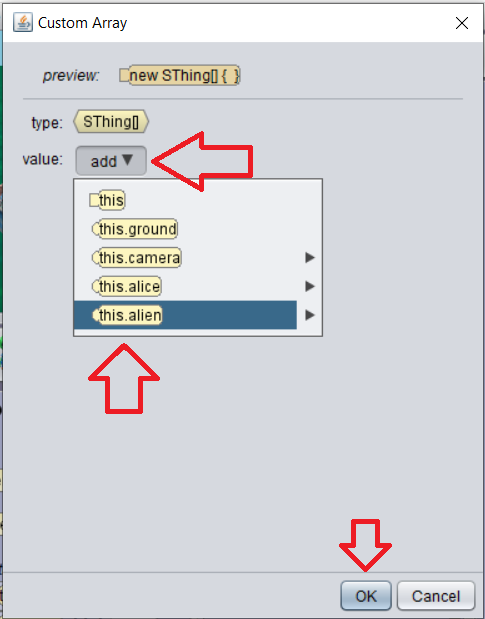
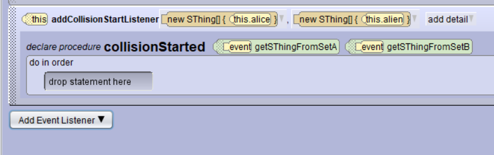
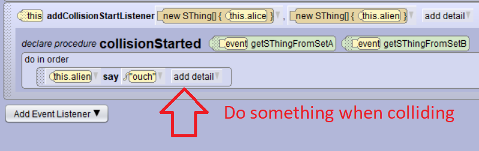

# Collisions

Collisions are an essential part of any program, and you have used these in Scratch and Play lab. Collisions are necessary for any game and what makes games fun.  How is it done here?

<!-- video here -->

<a href="//www.youtube.com/embed/bfakh5eiNrM" data-lity>Collisions Video</a>
