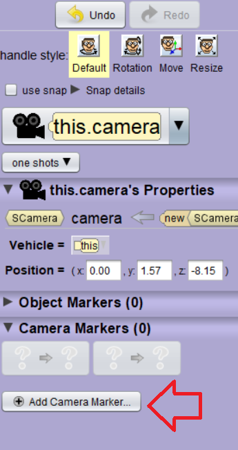
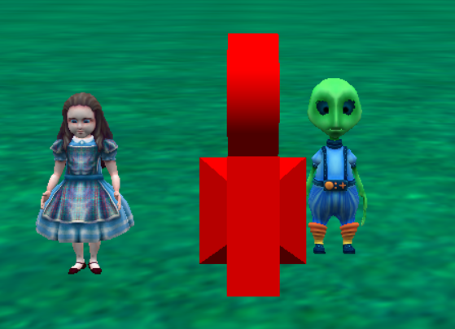
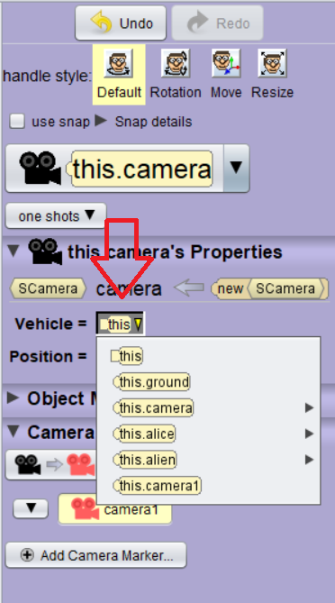

# Moving the Camera

Keep in mind that the scene might leave the initial view.  To move around the world, we must move the camera.  To do that, we must create different camera locations and make the camera move when the characters move.  Camera movement is essential, and there is a nuance in which we will explore here.  Let's take a look at how this works in Alice.

<!-- video here -->
## Camera Markers

In the setup scene, after selecting the Camera Object, you can click on Add Camera Marker and it will create a camera marker in that area.

If you scroll back with your mouse, you can see the marker once you create one.

<a href="//www.youtube.com/embed/JhCFmWBmAfA" data-lity>Camera Marker Video</a>

## Camera Vehicle

You can also set the camera vehicle to be attached to an object in the scene.

<!-- camera vehicle -->

<a href="//www.youtube.com/embed/PS0rbtFZ-U4" data-lity>Camera Vehicle Video</a>
