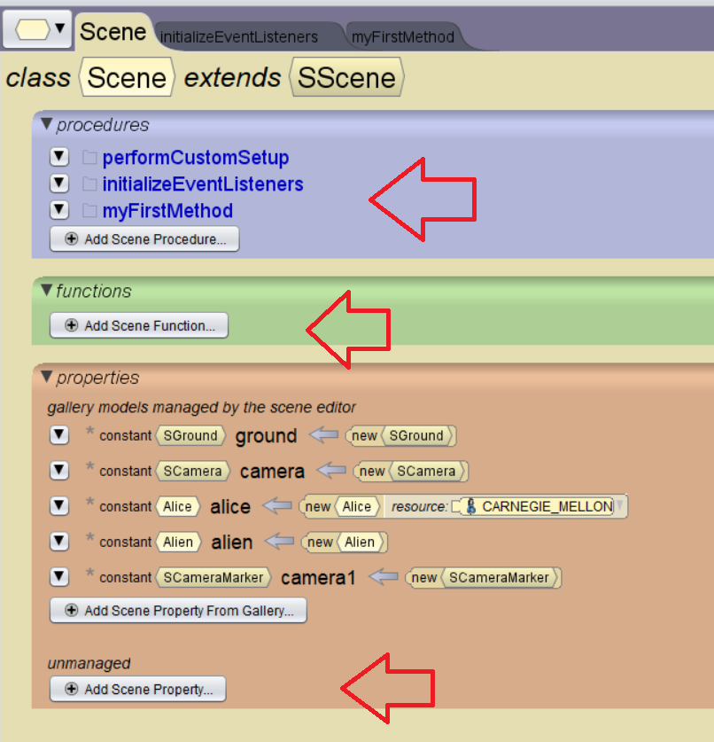

# Variables and Functions

In Alice, creating `global` variables, procedures, and functions allows you to use them in the first method or other areas.  Let's look at how we can implement and interact with these in Alice.

<!-- video -->
### Variables

<a href="//www.youtube.com/embed/v223_xvGGIA" data-lity>Variables Video</a>

### Functions

<a href="//www.youtube.com/embed/WnJ3CL_igO4" data-lity>Functions Video</a>
