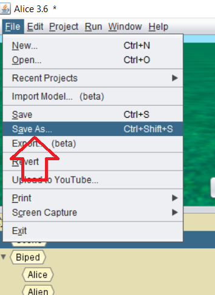
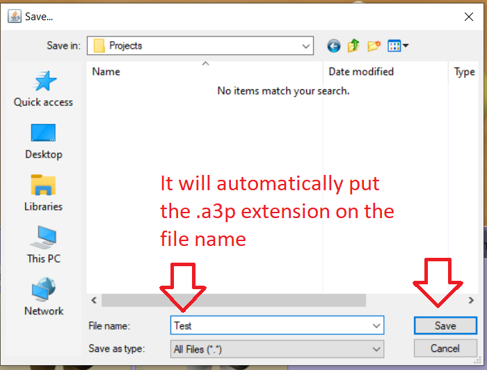

# Save your project

Upon completion, you want to save your project.  The following video shows you how to protect your `.a3p` file.  

<a href="//www.youtube.com/embed/KJ_m-cZa5oc" data-lity>Save File Video</a>
