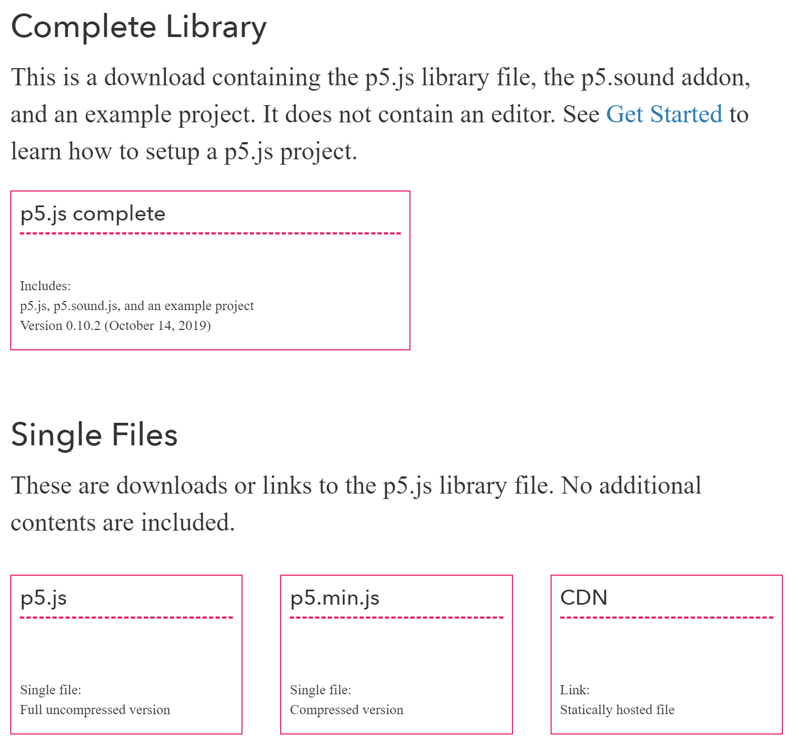

# Using p5.js

<div class="tab">
    <button class="tablinks active" onclick="openTab(event, 'Web')">Web Editor</button>
    <button class="tablinks" onclick="openTab(event, 'CDN')">CDN</button>
    <button class="tablinks" onclick="openTab(event, 'Offline')">Offline</button>
     <button class="tablinks" onclick="openTab(event, 'Video')">Video</button>
</div>
<!-- Tab content -->
<div id="Web" class="tabcontent" style="display:block">

<div class="tabhtml" markdown="1">

Using p5, we have a few options in which we can implement and use this library.

The first way is by using the web editor on the p5js.org website.  Look for the button the home page that says **Start creating with the p5 Editor**


Then, you can create sketches directly on the web, which is fantastic!  However, it would help if you were online for this to work.

Here is the editor.

<iframe src="https://editor.p5js.org/" width="100%" height="800px"></iframe>

If you click the start button, you won't see much but a 400x400 grey colored square.  If you change the numbers, you will see a different sized square if you alter the create canvas numbers.  

If you change the number in the background, it will change the greyscale color.  You can put RGB colors in there too.

```js
  background(123,23,129);
```

What other options do we have, though?  

</div>
</div>


<div id="CDN" class="tabcontent">

<div class="tabhtml" markdown="1">

Remember when we used a CDN with Bootstrap?  You can do the same thing here.  It looks like this.

```html
<script src="https://cdnjs.cloudflare.com/ajax/libs/p5.js/1.1.9/p5.min.js"></script>
```

How does this work on an HTML page?  We can create a second sketch.js page.

```html
<html>
  <head>
    <script src="https://cdnjs.cloudflare.com/ajax/libs/p5.js/1.1.9/p5.min.js"></script>
    <script src="sketch.js"></script>
  </head>
  <body>
  </body>
</html>
```

Now, you may be saying, wait, from where did that sketch.js file come? And where is it located?

Here's the deal.  The sketch.js file is your file and located in the same directory or folder as our HTML page.  It allows us to put all our p5.js code in a file we create, and then we don't have to change our HTML page again.  It just makes things a little cleaner to read.

The file looks like this.

```js
function setup() {
  createCanvas(400,400);
}

function draw() {
  background(220);
}
```

Look familiar?  It should! It is the same code as what we say in the web editor. However, what was it with CDN's?  It means that we still have to be online.  So, what can we do to ensure that we can work on p5.js offline?

</div>
</div>

<div id="Offline" class="tabcontent">

<div class="tabhtml" markdown="1">

We can download the library and then reference it.

Go to the download page and choose from a couple of options.

<a href="https://p5js.org/download/" target="_new">Download page</a>

If you look, you should see this.



You have a couple of options, but if you right-click and download the p5.js or p5.min.js and then put that into a script tag, you will have an offline solution.  Make sure you save the file in the same directory as your HTML file.

```html
  <script src="p5.min.js"></script>
```

Where do we go from here? Now that we have our initial set up done, we can focus on the setup and the draw.

</div>
</div>

<div id="Video" class="tabcontent">
<div class="tabhtml" markdown="1">

<div class="embed-responsive embed-responsive-16by9"><iframe class="embed-responsive-item" src="https://www.youtube.com/embed/waAYzO6wojQ" frameborder="0" allowfullscreen></iframe></div>

</div>
</div>